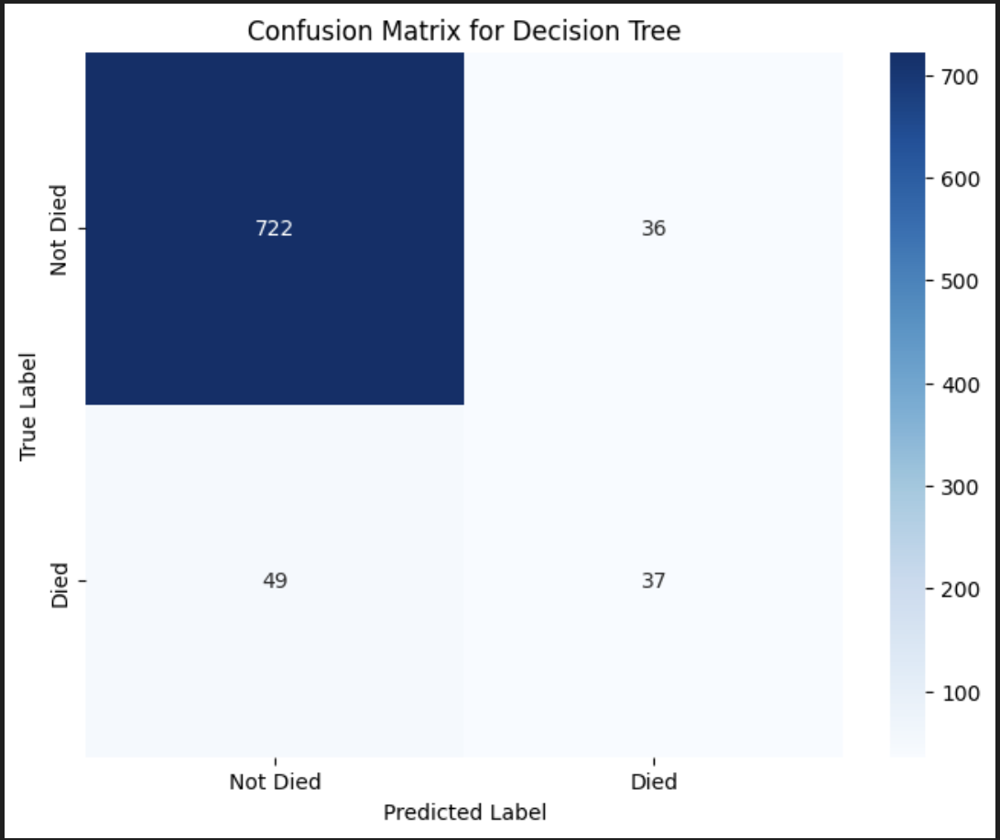
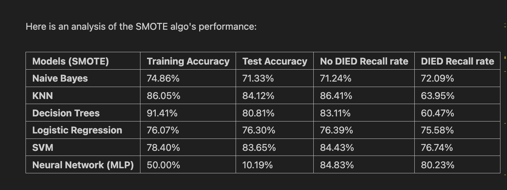

# Smote-Heart-Attack-ML: In-Hospital Mortality Prediction 🫀

**Course Project / Production-Style ML Demo:** This project predicts in-hospital mortality for heart attack patients using classical machine learning models. It focuses on addressing **severe class imbalance** and demonstrates a complete, modular **CLI-based** ML pipeline.

## 🎯 Project Goals and Key Takeaways

| Goal | Description |
| :--- | :--- |
| **Problem** | Predict in-hospital mortality (`DIED=1`) based on patient attributes (age, sex, length of stay, charges, diagnosis codes). |
| **Class Imbalance** | The positive class (`DIED=1`) is rare (\~9%). The primary evaluation metric is **Recall for the minority class**. |
| **Key Finding** | **Decision Tree** achieved the strongest baseline performance; **SMOTE** substantially improved minority-class recall across multiple classifiers. |

-----

## 🛠️ Tech Stack

  * **Core Libraries:** Python, pandas, scikit-learn, imbalanced-learn
  * **Environment:** Virtualenv, **Modular CLI Scripts**, Jupyter Notebook (for optional EDA/Visualization)
  * **Structure:** Reproducible, production-style project structure with dedicated modules for data I/O, feature engineering, and modeling.

-----

## 📂 Repository Structure

The project separates logic into distinct modules for clear architecture and maintainability.

```
<project-dir>/
├─ data/
│  ├─ raw/              # Raw CSV dataset (place whole_table.csv here)
│  └─ processed/        # Cleaned data, metrics (metrics.json), trained models (.joblib)
├─ notebooks/
│  └─ heart_attack_eda.ipynb # Exploratory Data Analysis and visualization
├─ src/
│  ├─ __init__.py
│  ├─ config.py         # Constants and paths
│  ├─ data_loader.py    # Data I/O and minimal cleaning (e.g., coercing CHARGES to numeric)
│  ├─ features.py       # Preprocessing (OHE for categoricals, scaling for numerics)
│  ├─ models.py         # Model factory, SMOTE logic, training implementation
│  └─ evaluate.py       # Metrics helpers
├─ scripts/
│  ├─ train.py          # CLI script for model training
│  └─ evaluate_model.py # CLI script for model evaluation
├─ requirements.txt
└─ README.md
```

-----

## ⚙️ Models and Methods

The project trains and compares six classic machine learning models. **SMOTE** (Synthetic Minority Oversampling Technique) from `imblearn` is applied optionally to address class imbalance.

  * **Models:** Naive Bayes, K-Nearest Neighbors (KNN), Decision Tree, Logistic Regression, Support Vector Machine (SVM), Multi-layer Perceptron (NN).
  * **Metrics:** Training/Test Accuracy, Recall for both classes (emphasizing `DIED` recall).

|:----------------------:|:---------------:|:---------------:|
|  |  |  | 

-----

## 🏃 Quick Start: Run the Pipeline

### 1\) Environment Setup

Create a virtual environment and install dependencies:

```bash
python -m venv .venv
source .venv/bin/activate        # Windows: .venv\Scripts\activate
pip install -r requirements.txt
```

### 2\) Place the Dataset

Put the dataset `whole_table.csv` into the **`<project-dir>/data/raw/`** folder.

### 3\) Train a Model (CLI)

Use the CLI script to train models with defined parameters.

```bash
# Navigate to the project directory
cd <project-dir>

# Example: Train a Decision Tree model with SMOTE applied
python -m scripts.train --model decision_tree --smote

# Example: Train a Logistic Regression model without SMOTE
python -m scripts.train --model logistic_regression
```

**Outputs:**

  * Model Artifact: `<project-dir>/data/processed/trained_model.joblib`
  * Metrics: `<project-dir>/data/processed/metrics.json`

### 4\) Evaluate a Saved Model

Evaluate the performance of any saved model artifact:

```bash
# Evaluate the model saved in the previous step
python -m scripts.evaluate_model --model-path data/processed/trained_model.joblib
```

### 5\) Run EDA Notebook (Optional)

To view the full data prep, modeling, and visualization workflow:

```bash
jupyter notebook
# Open notebooks/heart_attack_eda.ipynb and run all cells
```

-----

### ⚠️ Disclaimer

### **This project is for educational and academic purposes only and is not intended for use in clinical or medical decision-making.**