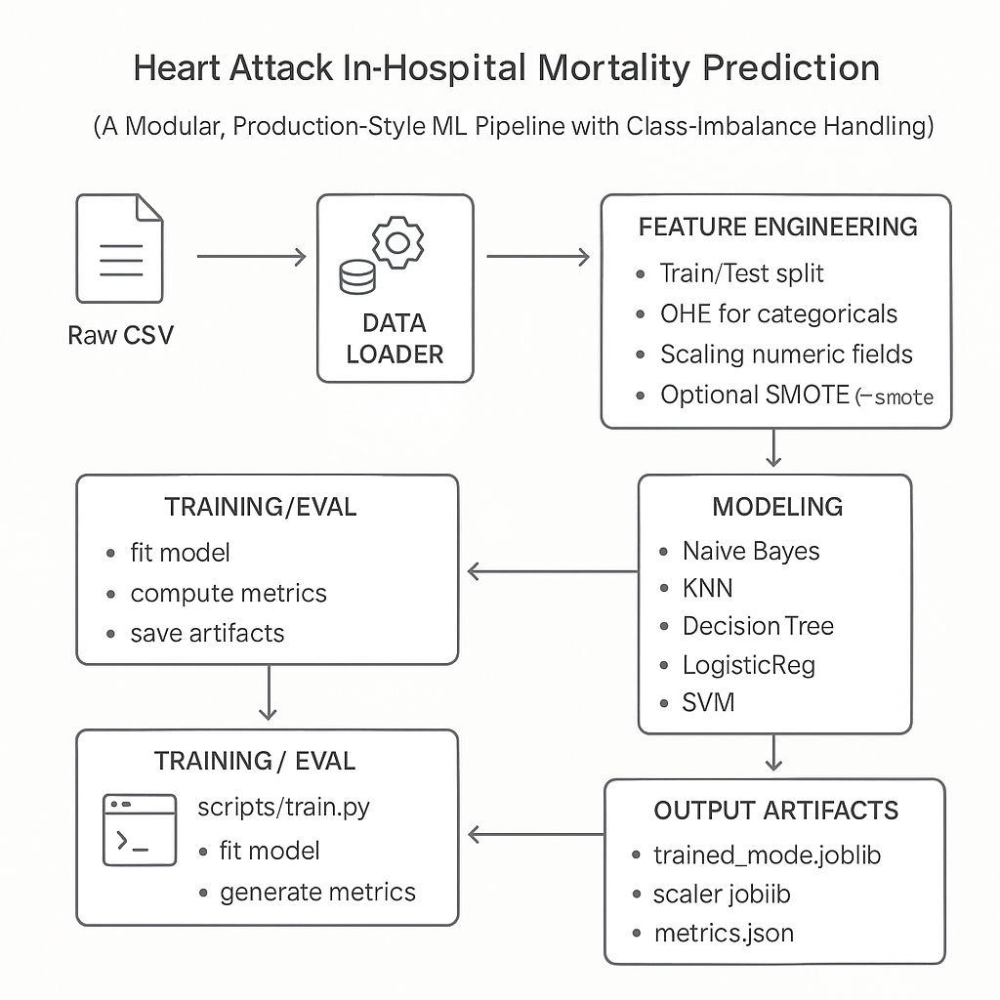
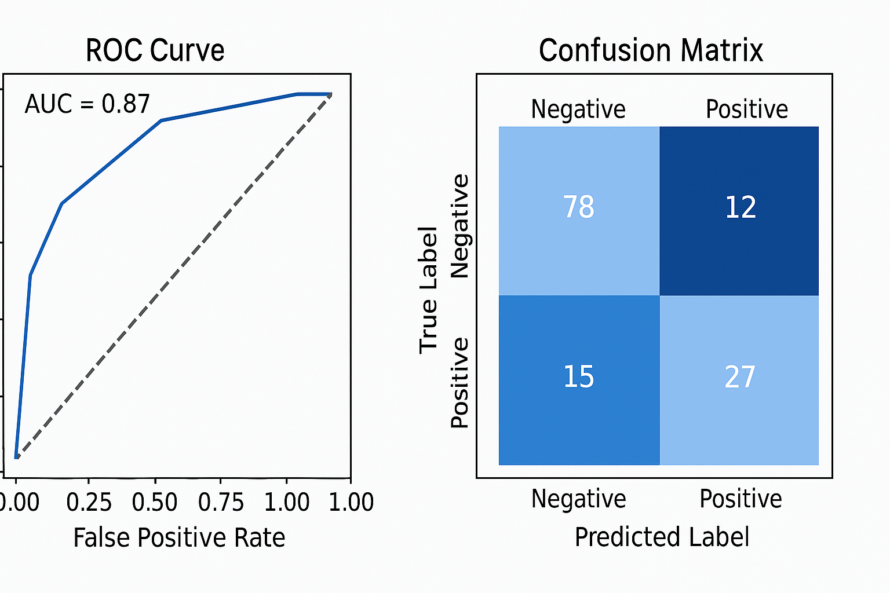
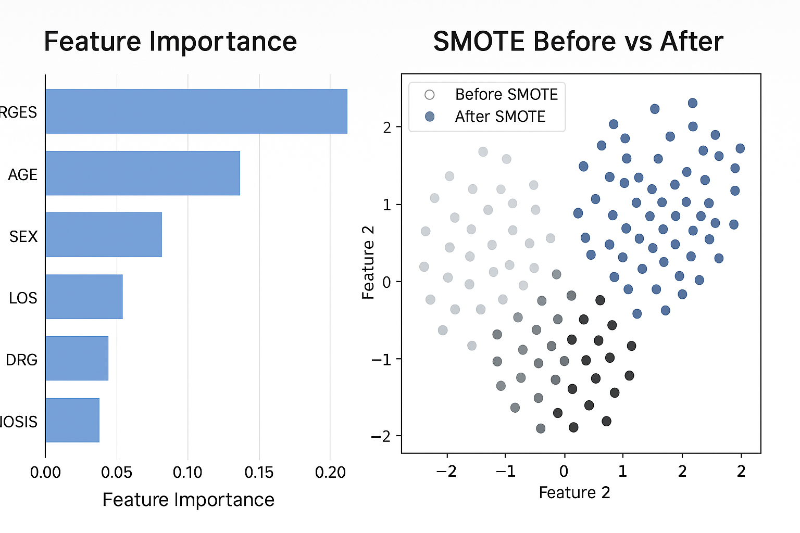

<div align="center">

# 🫀 Heart Attack Risk Prediction — In-Hospital Mortality ML Pipeline
</div>

**Modular, Production-Style ML Pipeline with Class-Imbalance Handling**

A reproducible ML system from end-to-end data ingestion, feature engineering, model comparison, SMOTE-based imbalance correction, and CLI-driven training & evaluation workflows.

Demonstrates how to go from raw CSV → cleaned features → baseline models → reproducible CLI pipeline, with optional SMOTE to address severe class imbalance.

---

## 🎯 Project Overview

| Goal | Description |
| :--- | :--- |
| **Prediction Task** | Predict whether a patient died during hospitalization (DIED = 1). |
| **Dataset** | Clinical + administrative attributes (age, sex, length of stay, DRG, charges, diagnosis codes). |
| **Class Imbalance** | Positive class ≈ 9% → minority recall is the key metric. |
| **Key Finding** | SMOTE significantly improves DIED=1 recall across multiple models; Decision Tree delivered the strongest baseline. |

---

### 📊 Architecture Overview



---
> <div align="center">

> 
> **DATA LAYER**
>
> 1. Raw CSV (`whole_table.csv`)
> 2. **src/data_loader.py** → minimal cleaning
>     * CHARGES coercion
>     * dtype fixing
>     * missing drop/clean
>   
> **FEATURE ENGINEERING**
>
> 3. **src/features.py**
>     * Train/Test Split
>     * OHE for categoricals
>     * Scaling numeric fields
>     * Optional SMOTE (`--smote`)
>
> **MODELING LAYER**
>
> 4. **src/models.py** → Model Factory
>     * Naive Bayes, KNN, Decision Tree, Logistic Regression, SVM, MLP
>     * Select model via CLI flag: `--model <name>`
>
> **TRAINING / EVAL**
>
> 5. **scripts/train.py** & **scripts/evaluate_model.py**
>     * fit model, compute metrics, save artifacts
>
> **OUTPUT ARTIFACTS**
>
> 6. **data/processed/**
>     * `trained_model.joblib` (final model)
>     * `scaler.joblib` (for numeric fields)
>     * `metrics.json` (recall, accuracy, reports)
>
> **NOTEBOOK**
>
> 7. **notebooks/heart_attack_eda.ipynb**
>     * EDA, feature exploration, visualizations (CM, ROC)
> 
> </div>
---

## 🛠️ Tech Stack

* **Core:** Python, pandas, scikit-learn, imbalanced-learn
* **ML Pipeline:** modular scripts, SMOTE support, artifact saving
* **Environment:** virtualenv + VS Code / terminal
* **Extras:** Jupyter Notebook for EDA & visualizations

---

## 📂 Repository Structure

```

<project-dir>/
├─ data/
│  ├─ raw/               # Raw CSV dataset (place whole\_table.csv here)
│  └─ processed/         # Cleaned data, metrics, trained models (.joblib)
├─ notebooks/
│  └─ heart_attack_eda.ipynb   # EDA + visualizations
├─ src/
│  ├─ __init__.py
│  ├─ config.py           # Paths & constants
│  ├─ data_loader.py      # CSV loading + basic cleaning (e.g., coercing CHARGES numeric)
│  ├─ features.py         # Preprocessing (OHE for categoricals, scaling for numerics)
│  ├─ models.py           # Model factory, SMOTE, training logic,training implementation
│  └─ evaluate.py         # Metric utilities (accuracy, recall, reports)
├─ scripts/
│  ├─ train.py            # CLI script for model training
│  └─ evaluate_model.py   # CLI script for model evaluation
├─ requirements.txt
└─ README.md

```

---

## ⚙️ Models & Methods

The project trains six classic ML models:
* Naive Bayes
* KNN
* Decision Tree
* Logistic Regression
* SVM
* MLP (Neural Network)

**SMOTE** is optionally applied to mitigate heavy class imbalance.

Metrics evaluated:
* Accuracy
* Recall for class 0 and 1
* Emphasis: positive-class recall (DIED=1)
  
---

## 📈 Model Performance

### ROC Curve & Confusion Matrix


### 📊 Feature Importance & SMOTE Impact

Below are the key model insights, including feature importance rankings and  
a visualization of class distribution before and after applying SMOTE.



---

## 🏃 Quick Start — Run the Pipeline

### 1\. Environment Setup

```bash
python -m venv .venv
source .venv/bin/activate        # Windows: .venv\Scripts\activate
pip install -r requirements.txt
````

### 2\. Place the Dataset

Put the dataset here:

`<project-dir>/data/raw/whole_table.csv`

Or pass a custom path via `--raw-csv`.

### 3\. Train a Model

Example: Decision Tree + SMOTE

```bash
cd <project-dir>
python -m scripts.train --model decision_tree --smote
```

Example: Logistic Regression (no SMOTE)

```
bash
python -m scripts.train --model logistic_regression
```

Outputs generated:

  * `data/processed/trained_model.joblib`
  * `data/processed/metrics.json`

### 4\. Evaluate a Saved Model

```bash
python -m scripts.evaluate_model --model-path data/processed/trained_model.joblib
```

### 5\. Optional: Run the EDA Notebook

```bash
jupyter notebook
# open: notebooks/heart_attack_eda.ipynb
```

The notebook mirrors the full workflow (EDA → preprocessing → modeling → visualization).

-----

## 🧪 Notes & Implementation Details

  * **CHARGES** may contain "." — coerced to numeric with `errors="coerce"`
  * Missing values handled in preprocessing
  * SMOTE activated via `--smote`
  * Minority recall emphasized because DIED=1 is medically critical
  * Designed as a teaching example, not a clinical decision tool

-----

## ⚠️ Disclaimer

This project is for educational purposes only and not intended for clinical or medical use.
